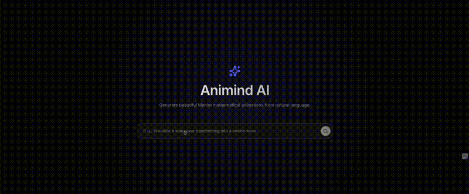

# Animind AI



Generate and edit mathematical animations with AI — schema-driven, deterministic, and fully interactive.

Animind AI uses the power of Large Language Models (LLMs) to convert natural language descriptions of mathematical or educational scenes into fully functioning Python code using the [Manim](https://www.manim.community/) engine.

## How It Works

Animind adopts a deterministic, multi-agent pipeline to generate robust Manim code:

1. **JSON Generation Agent**: Parses the user's natural language input and translates it into a structured, intermediate JSON schema representing the animation sequence, objects, and properties.
2. **Code Generation Agent**: Reads the deterministic JSON schema and produces the exact Manim Python code required to render the scene.
3. **Validation Agent**: Evaluates the generated Python code to ensure syntactic correctness and valid Manim application.

This structured pipeline ensures more consistency, interpretability, and editability compared to raw zero-shot code generation models.

## Prerequisites

- **Python $\ge$ 3.13**
- **[uv](https://docs.astral.sh/uv/)** for fast Python dependency management.
- An **[OpenRouter](https://openrouter.ai/)** API key for LLM requests (currently running `gpt-4o-mini`).
- System-level dependencies for Manim (e.g., FFmpeg, LaTeX). Refer to the [Manim installation guide](https://docs.manim.community/en/stable/installation.html) for your specific operating system.

## Quickstart

### 1. Install Dependencies

In the `backend` directory, use `uv` to sync and install the project dependencies:

```bash
cd backend
uv sync
```

### 2. Configure Environment

Copy the example environment configuration:
```bash
cp .env.example .env
```
Insert your OpenRouter API key inside the newly created `.env` file:
```env
OPENROUTER_API_KEY="your_api_key_here"
```

### 3. Run the AI Pipeline

You can interactively test the generation pipeline with the main executable script:

```bash
uv run python main.py
```

When prompted:
```text
Enter your animation idea: 
```

Provide an idea (e.g., *"Create a red circle that grows and morphs into a blue square"*). The script will output:
1. The structured JSON Schema representation.
2. The generated Manim Python code.
3. The result of the code validation check.

## Architecture

- `backend/agents/`: Contains the modular multi-agent system (`json_generation_agent.py`, `code_generation_agent.py`, `validation_agent.py`).
- `backend/schema/`: Pydantic/JSON models that enforce the structure of the intermediate generation steps.
- `backend/services/llm.py`: A wrapper utilizing LiteLLM to route intelligent prompts to OpenRouter models.
- `backend/prompts/`: Standardized system instructions and examples for the LLM agents.

## Stack & Tools

- **[Manim](https://manim.community/)**: The mathematical animation engine compiling Python scripts into beautiful video scenes.
- **[LiteLLM](https://github.com/BerriAI/litellm)**: A unified interface to orchestrate completions across multiple LLM providers seamlessly.
- **[uv](https://docs.astral.sh/uv/)**: Python packaging and resolution tool written in Rust, significantly speeding up project setup.
